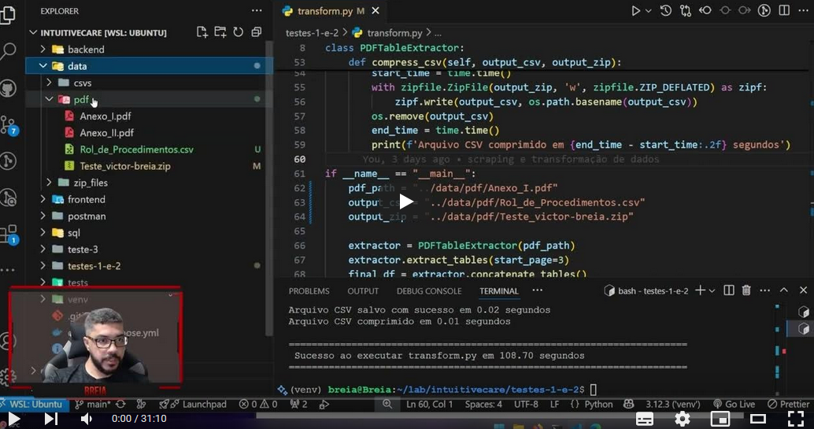

# 🏥 IntuitiveCare - Teste de Nivelamento  

Bem-vindo(a) ao repositório do **Teste de Nivelamento** para a IntuitiveCare! 🚀  
Este projeto foi desenvolvido para demonstrar habilidades em **coleta, transformação, armazenamento e análise de dados**, além da criação de uma API interativa.  

---

# **IntuitiveCare - Testes 1️⃣, 2️⃣, 3️⃣ e 4️⃣**

Este repositório contém a implementação de quatro testes que abrangem diferentes áreas de desenvolvimento, incluindo web scraping, transformação de dados, manipulação de banco de dados e desenvolvimento de uma API com integração frontend.

---

## 🎥 **Vídeo Explicativo**

Clique na imagem abaixo para assistir ao vídeo explicativo sobre o projeto:

[](https://youtu.be/peI5eTaFIxg?si=7HOYM6SCSCKtosRB)

---

## **1️⃣ Web Scraping**

O objetivo do Teste 1 é realizar o download de um arquivo PDF a partir de uma página da web. O script `scraping.py` utiliza as bibliotecas `requests` e `BeautifulSoup` para acessar a página, localizar o link do PDF e realizar o download do arquivo para o diretório `../data/pdf`.

- [Informações completas](testes-1-e-2/README.md)

---

## **2️⃣ Transformação de Dados**

O Teste 2 consiste em processar o arquivo PDF baixado no Teste 1, extrair tabelas e transformar os dados em um formato estruturado. O script `transform.py` utiliza as bibliotecas `PyPDF2`, `tabula` e `pandas` para extrair as tabelas, renomear colunas, concatenar os dados em um único DataFrame e exportá-los como um arquivo CSV compactado.

- [Informações completas](testes-1-e-2/README.md)

---

## **3️⃣ Banco de Dados**

O Teste 3 tem como objetivo processar e analisar dados relacionados a operadoras de saúde. Ele utiliza scripts Python para descompactar arquivos ZIP, processar arquivos CSV e popular tabelas em um banco de dados PostgreSQL. Além disso, consultas SQL são realizadas para responder a perguntas específicas sobre os dados.

- [Informações completas](teste-3/README.md)

---

## **4️⃣ API e Frontend**

O Teste 4 envolve o desenvolvimento de uma API em Python utilizando **FastAPI** e uma interface web em **Vue.js**. A API realiza buscas textuais em uma lista de operadoras de saúde, enquanto o frontend exibe os resultados de forma interativa. O projeto utiliza Docker para facilitar a execução e integração entre backend e frontend.

- [Informações completas](backend/README.md)

---

## 🛠 **Tecnologias Utilizadas**  

- **Linguagem:** Python 3.10+  
- **Bibliotecas:** `requests`, `BeautifulSoup`, `PyPDF2`, `pandas`, `tabula`, `SQLAlchemy`, `FastAPI`  
- **Banco de Dados:** PostgreSQL (Docker)  
- **API:** FastAPI  
- **Frontend:** Vue.js (Docker)  
- **Testes:** Postman (Docker)  

---

## 📂 **Estrutura do Projeto**  

```bash
📦 intuitivecare
│── 📂 testes-1-e-2            # Contendo o teste de web scraping e transformação de dados
│   ├── 📜 app.py              # Aplicativo Python que roda os scripts
│   ├── 📜 scraping.py         # Script Python que faz o scraping
│   ├── 📜 transform.py        # Script Python que transforma os dados
│── 📂 teste-3                 # Contendo o teste de SQL
│   ├── 📜 populate_tables.py  # Script Python que popula as tabelas do banco postgres
│   ├── 📜 unziper.py          # Script Python que descompacta os arquivos CSV do teste 3
│   └── 📂 sql                 # Contendo as queries utilizadas para solucionar o teste 3
│       ├── 📜 1.setup.sql     # Script SQL para criar o banco de dados
│       ├── 📜 2.scheema.sql   # Script SQL para criar as tabelas
│── 📂 backend                 # Contendo a API FastAPI
│   ├── 📜 main.py             # Código principal da API
│   ├── 📜 dockerfile          # Dockerfile para o backend
│── 📂 frontend                # Contendo a interface web em Vue.js
│   ├── 📂 src                 # Código-fonte do frontend
│   │   ├── 📂 components      # Componentes Vue.js
│   │   │   ├── 📜 SearchOperadoras.vue  # Componente para buscar operadoras
│   │   ├── 📜 App.vue         # Componente principal do Vue.js
│   │   ├── 📜 main.js         # Arquivo de entrada do Vue.js
│   ├── 📜 dockerfile          # Dockerfile para o frontend
│── 📜 README.md               # Documentação do projeto
│── 📜 .gitignore              # Arquivos ignorados pelo Git
│── 📜 docker-compose.yml      # Docker Compose para rodar o projeto
│── 📜 requirements.txt        # Bibliotecas necessárias para rodar o backend
│── 📂 sql                     # DDL que inicia junto ao docker quando sobe o banco
│── 📂 data                    # Outputs do projeto
│   ├── 📜 Relatorio_cadop.csv # Arquivo CSV com os dados processados
```

---

## 🛠️ **Execução Geral**

Para rodar todas as dependências de todos os testes, basta executar o seguinte comando na raiz do projeto:

```bash
docker-compose up --build
```

Cada teste possui um README específico com instruções detalhadas para execução. Certifique-se de seguir as orientações de cada pasta (`testes-1-e-2`, `teste-3`, `backend`) para rodar os scripts e obter os resultados esperados.

---
